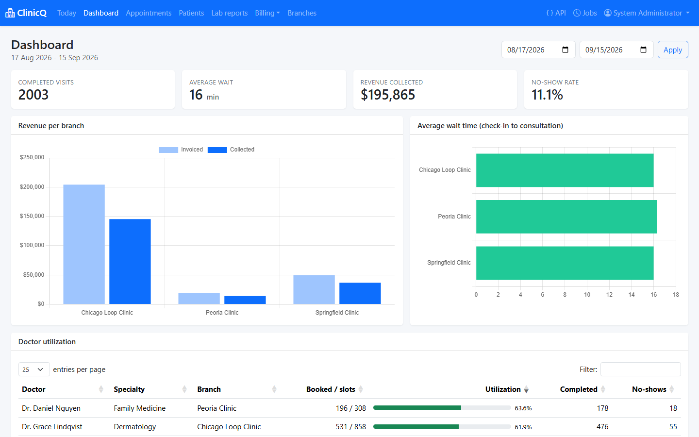
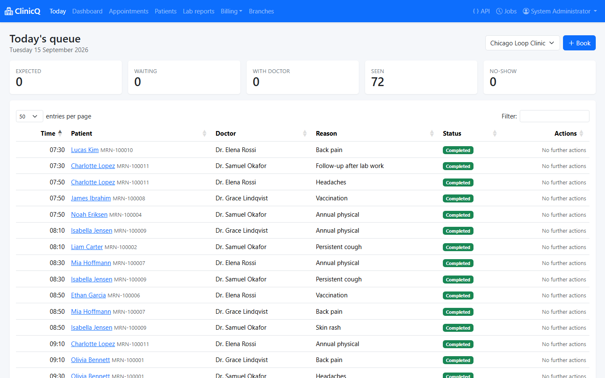
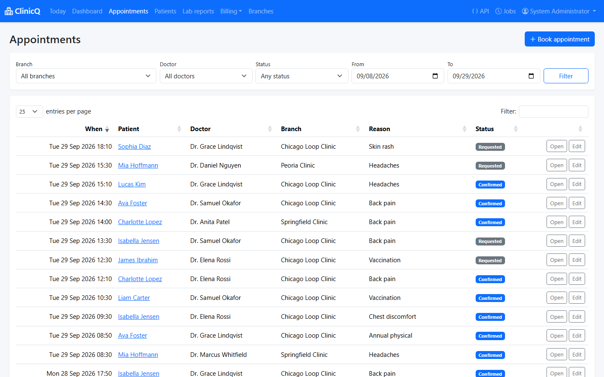
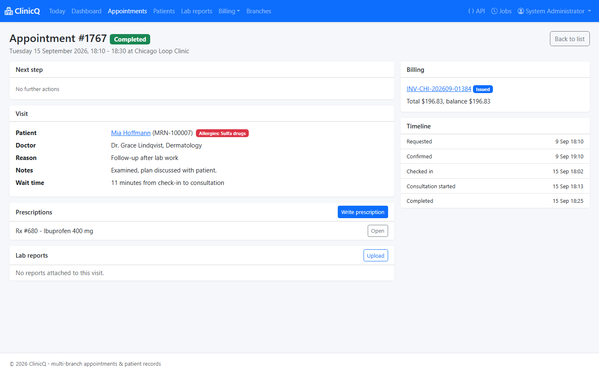
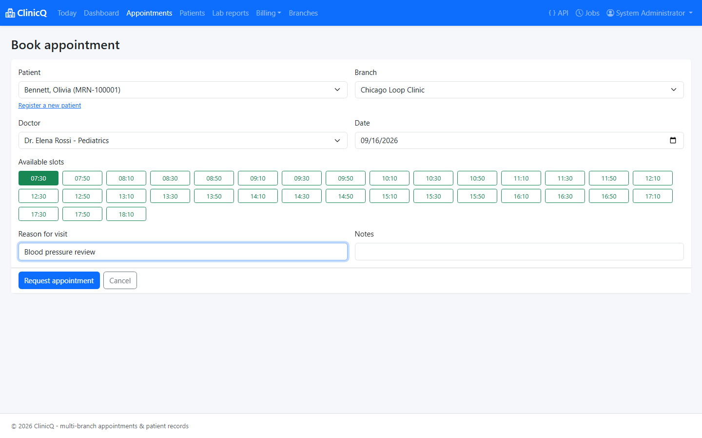
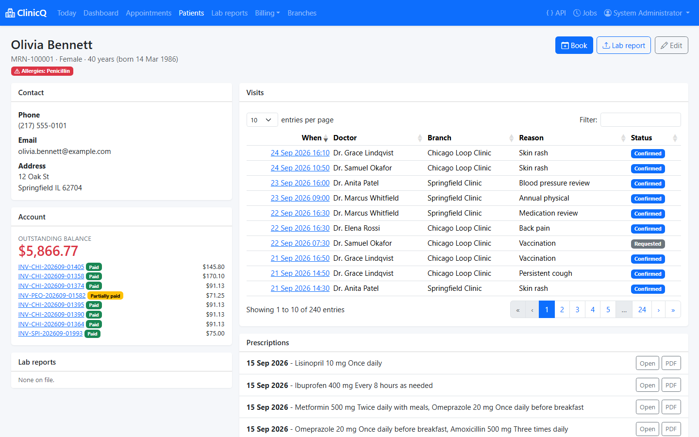
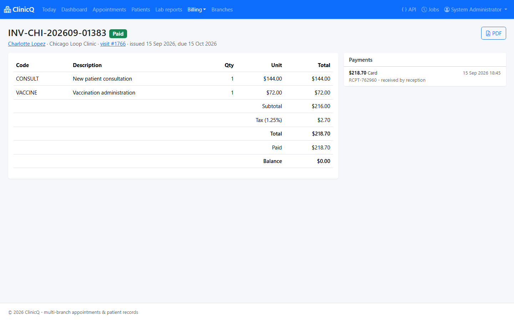
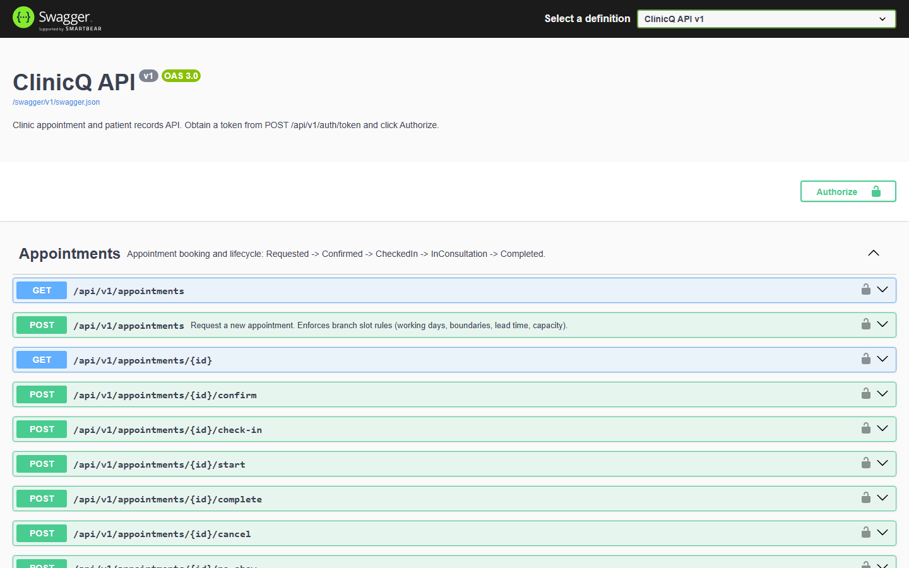

# ClinicQ

[](https://github.com/taminulislam/clinicq/actions/workflows/ci.yml)

Clinic appointment and patient records portal for a multi-branch clinic. Front-desk staff book and
move appointments through a guarded lifecycle, doctors record consultations and prescriptions,
and the billing office raises invoices from a per-branch fee schedule and reconciles them nightly.
The same application exposes a versioned REST API with JWT bearer authentication so other systems
can book slots, upload lab reports and pull the operational metrics behind the dashboard.

**History:** originally built on ASP.NET Core 5 (Web API + Razor Pages) with Dapper over SQL Server
stored procedures, FluentValidation, Hangfire, Azure Blob Storage, SendGrid, QuestPDF, jQuery,
Bootstrap, Swagger, JWT and Azure DevOps. The code has since been upgraded to **.NET 8**.

## Live demo

[](https://codespaces.new/taminulislam/clinicq?quickstart=1)

Launch a Codespace, then run:

```bash
dotnet run --project src/ClinicQ.Web --urls http://localhost:5102
```

Open the forwarded port **5102** and sign in with **`admin` / `Passw0rd!`** (or `reception`,
`drpatel`, `billing` - same password). Swagger UI is at `/swagger`.

The demo runs entirely on **SQLite**: the schema is created and roughly 3,000 appointments with
invoices, payments and prescriptions are seeded on first start, so the dashboard and grids have
real data immediately. No Azure resources, SQL Server instance or API keys are required - email
falls back to the log and lab report uploads to local disk.

## Screenshots

### Dashboard
Doctor utilization against schedulable slots, average wait time from check-in to consultation, and
revenue per branch, charted with Chart.js.



### Today's queue
The front-desk landing page: every appointment at a branch today, with one-click status moves that
only ever offer the transitions the state machine allows.



### Appointments
Server-filtered grid (branch, doctor, status, date range) rendered with DataTables.



### Appointment detail
A completed visit: the full lifecycle timeline, measured wait time, the prescription issued and the
invoice it generated.



### Booking
Slots come from the branch rule via AJAX - 20-minute slots here, with taken slots disabled and lead
time and opening hours already applied.



### Patient record
Demographics and allergies, visit history, prescriptions, lab reports and the outstanding balance.



### Invoice
Line items priced from the branch fee schedule, discount and tax, recorded payments and the PDF
export.



### Swagger UI
The versioned REST API with bearer authentication; every appointment lifecycle step is an endpoint.



## Architecture

One ASP.NET Core 8 web application serves two faces over one domain and data layer:

- **Razor Pages portal** for clinic staff, cookie authentication, Bootstrap 5 + jQuery + DataTables.
- **REST API** at `/api/v1`, JWT bearer authentication, documented with Swagger.

```
src/ClinicQ.Domain   appointment state machine, slot rules, fee/discount calculation, invoice aggregate
src/ClinicQ.Web      Razor Pages, API controllers, Dapper repositories, Hangfire jobs, PDF/email/storage
tests/ClinicQ.Tests  xUnit: domain, validators, repositories on SQLite, services, jobs, API integration
db/                  SQL Server schema, seed data and stored procedures
infra/               Bicep for App Service + slot, Azure SQL, Key Vault, Blob, App Insights
docs/                architecture, deployment and change management
```

Data access is **Dapper over hand-written SQL** - no ORM, so the SQL under test is the SQL that
runs in production. Two providers are supported and picked at startup:

| | SQL Server / Azure SQL | SQLite (fallback) |
| --- | --- | --- |
| Used when | `ConnectionStrings:Default` is set | it is empty |
| Schema | `db/001_schema.sql` + `002_seed.sql` + `003_procs.sql` | embedded script, created at startup |
| Slot lookup | `usp_GetAvailableSlots` | `SlotGenerator` + inline SQL |
| Reconciliation | `usp_ReconcileBilling` | equivalent inline SQL |

See [docs/ARCHITECTURE.md](docs/ARCHITECTURE.md) for component and ER diagrams and the full
state machine.

## Features

- **Appointment lifecycle** - `Requested -> Confirmed -> CheckedIn -> InConsultation -> Completed`,
  with `Cancelled` and `NoShow` branches. Invalid moves raise domain exceptions and surface as
  409 Conflict; the portal shows the legal next steps as buttons and nothing else.
- **Configurable slot rules per branch** - opening hours, slot length, working days, overbooking
  capacity, minimum lead time and how far ahead patients may book. Booking validates every rule and
  cancelled appointments release their slot.
- **Fee schedule per branch** - effective-dated prices, age-based discount policy (senior/child),
  branch tax rate, and discount applied before tax with half-away-from-zero rounding.
- **Billing** - invoices generated from completed visits, partial and full payments, voiding, and a
  filtered unique index that allows re-invoicing a visit after a void.
- **Nightly reconciliation** - totals invoiced and collected per branch and flags completed visits
  that were never billed.
- **Background jobs** (Hangfire, in-memory) - appointment reminders, seven-day follow-up alerts and
  the nightly reconciliation. Dashboard at `/hangfire` for administrators.
- **Lab reports** - upload through an `IFileStorage` abstraction: Azure Blob Storage with
  short-lived SAS download links, or local disk when no storage account is configured.
- **PDFs** - prescriptions and invoices rendered with QuestPDF.
- **Email** - `IEmailSender` with a SendGrid implementation and a console fallback for local work.
- **Dashboard** - doctor utilization against schedulable slots, average wait time from check-in to
  consultation, revenue per branch, and no-show rate, charted with Chart.js.
- **REST API** - versioned routes, Swagger UI with bearer support, FluentValidation on request DTOs
  and RFC 7807 ProblemDetails for every error.

## Tech stack

ASP.NET Core 8 (Razor Pages + controllers), C# 12, Dapper 2.1, Microsoft.Data.SqlClient 5.2,
Microsoft.Data.Sqlite 8.0, FluentValidation 11, Hangfire 1.8 (+ MemoryStorage), QuestPDF 2024.10,
Azure.Storage.Blobs 12, SendGrid 9, Swashbuckle 6.8, Asp.Versioning 8.1, JWT bearer auth,
Serilog 8, xUnit 2.9 with `WebApplicationFactory`, Bootstrap 5, jQuery 3.7, DataTables 2.1,
Chart.js 4, Docker, Bicep, Azure DevOps pipelines and GitHub Actions.

## Running locally

Requires the .NET 8 SDK. No database setup is needed: with an empty `ConnectionStrings:Default` the
app creates a SQLite database (`app.db`), applies the schema and seeds demo data on first run.

```bash
git clone https://github.com/taminulislam/clinicq.git
cd clinicq
dotnet run --project src/ClinicQ.Web
```

Then open:

| URL | What |
| --- | --- |
| `https://localhost:7157` | Staff portal (today's queue) |
| `https://localhost:7157/swagger` | API documentation and try-it-out |
| `https://localhost:7157/hangfire` | Recurring job dashboard (admin) |
| `https://localhost:7157/health` | Health check |

Seeded users, all with password `Passw0rd!`:

| Username | Role | Sees |
| --- | --- | --- |
| `admin` | Admin | Everything, including branch configuration and Hangfire |
| `reception` | Receptionist | Booking, check-in, invoicing, payments |
| `drpatel` | Doctor | Consultations and prescriptions |
| `billing` | Billing | Invoices, payments and reconciliation |

First run seeds three branches, six doctors, twelve patients and roughly 3,000 appointments across
the previous 30 and next 14 days, with invoices, payments and prescriptions, so the dashboard and
reports are populated immediately. Set `Seed:DemoActivity=false` to seed reference data only, or
`Seed:Enabled=false` to skip seeding.

### Running against SQL Server

Deploy the scripts in order, then set the connection string:

```bash
sqlcmd -S localhost -d ClinicQ -i db/001_schema.sql
sqlcmd -S localhost -d ClinicQ -i db/002_seed.sql
sqlcmd -S localhost -d ClinicQ -i db/003_procs.sql

dotnet user-secrets --project src/ClinicQ.Web set "ConnectionStrings:Default" \
  "Server=localhost;Database=ClinicQ;Trusted_Connection=True;TrustServerCertificate=True"
```

The app verifies the schema at startup and uses the stored procedures for slot lookup, billing
reconciliation and branch revenue.

### Calling the API

```bash
TOKEN=$(curl -s -X POST http://localhost:5184/api/v1/auth/token \
  -H "Content-Type: application/json" \
  -d '{"username":"admin","password":"Passw0rd!"}' | jq -r .accessToken)

curl -s http://localhost:5184/api/v1/branches -H "Authorization: Bearer $TOKEN"
curl -s "http://localhost:5184/api/v1/branches/1/slots?doctorId=1&date=2026-03-10" \
  -H "Authorization: Bearer $TOKEN"
```

### Docker

```bash
docker build -t clinicq:local .
docker run --rm -p 8080:8080 clinicq:local
```

## Running the tests

```bash
dotnet test
```

163 xUnit tests cover the appointment state machine and aggregate rules, slot generation, fee and
discount calculation, invoice payment rules, every FluentValidation validator, PBKDF2 password
hashing, the Dapper repositories and reconciliation/dashboard queries against in-memory SQLite, the
booking and billing services, the recurring jobs, and the API end to end through
`WebApplicationFactory` with a real JWT.

The Postman collection in `tests/postman/ClinicQ.postman_collection.json` runs the same journey over
HTTP and is executed by the pipeline with Newman:

```bash
dotnet run --project src/ClinicQ.Web --urls http://localhost:5080 &
newman run tests/postman/ClinicQ.postman_collection.json \
  --env-var baseUrl=http://localhost:5080 \
  --env-var username=admin --env-var password='Passw0rd!'
```

## CI/CD

**GitHub Actions** (`.github/workflows/ci.yml`) restores, builds and tests on every push and pull
request to `main`, publishing the TRX results as an artifact - that is the badge at the top.

**Azure DevOps** (`azure-pipelines.yml`) is the release pipeline, in four stages:

1. **Build** - restore, build, publish the web app as a zip, stage `db/`, `infra/` and the Postman
   collection into the `drop` artifact.
2. **Test** - `dotnet test` with Cobertura coverage and TRX results, then a Newman job that boots
   the app on the SQLite fallback and runs the API collection.
3. **Deploy Dev** - `AzureWebApp@1` to the Dev site and applies the `db/` scripts. Runs only on
   `main`, against the `dev` environment.
4. **Deploy Prod** - deploys to the `staging` slot, smoke tests `/health` on the slot, then swaps
   staging into production with `AzureAppServiceManage@0`, gated by the `prod` environment.

Slot swap is also the rollback: swapping back restores the previous build in seconds. See
[docs/DEPLOYMENT.md](docs/DEPLOYMENT.md) for Azure resources, managed identity and Key Vault wiring,
and custom DNS, and [docs/CHANGE_MANAGEMENT.md](docs/CHANGE_MANAGEMENT.md) for the RFC template and
release checklist.

## Configuration

No secrets are committed. `appsettings.json` ships empty values and each one has a safe local
fallback; in Azure they are Key Vault references resolved by the web app's managed identity.

| Setting | Empty behaviour |
| --- | --- |
| `ConnectionStrings:Default` | SQLite `app.db` instead of SQL Server |
| `Jwt:SigningKey` | Random per-process key (tokens do not survive a restart) |
| `SendGrid:ApiKey` | Emails are written to the log instead of sent |
| `Storage:AzureBlobConnectionString` | Lab reports are stored under `storage/` on local disk |
| `Clinic:TimeZoneId` | Falls back to the machine's local time zone |

## License

Internal project, not licensed for redistribution.
