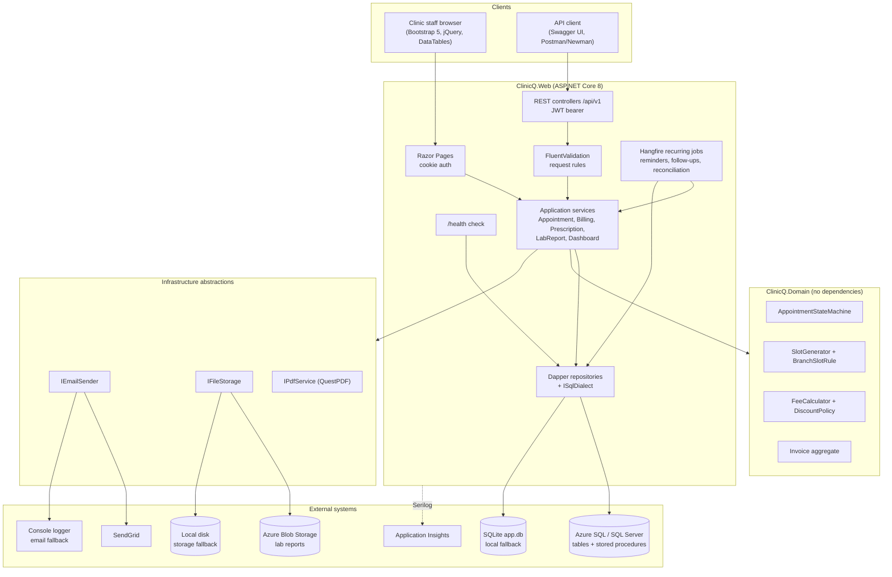
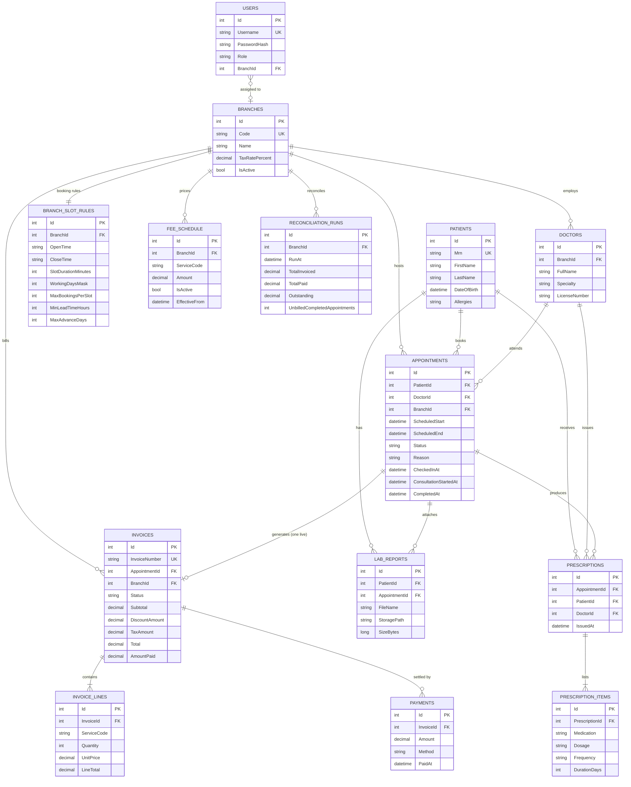
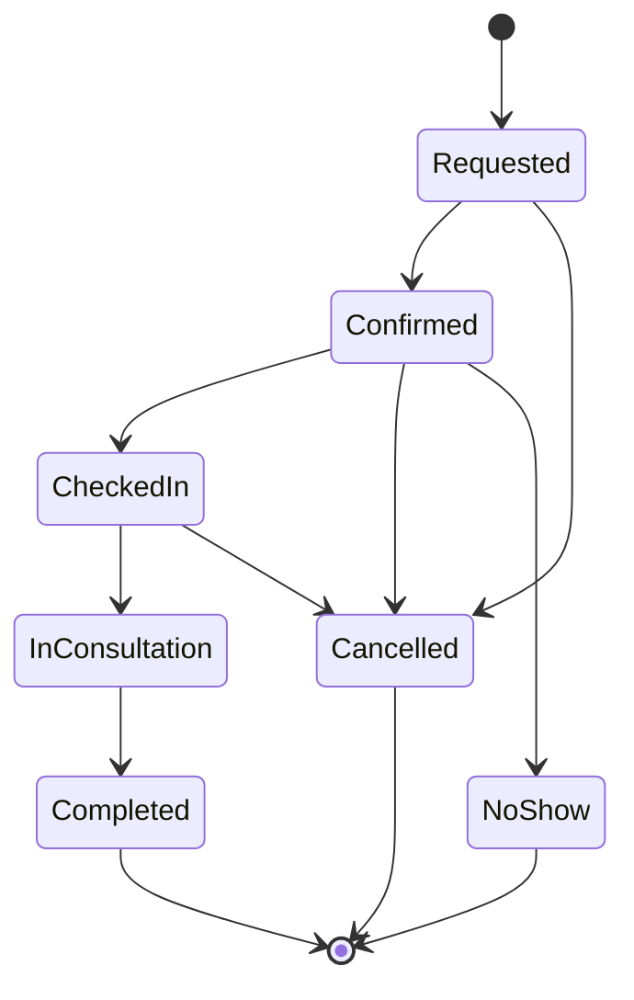

# ClinicQ architecture

ClinicQ is a single ASP.NET Core 8 web application that serves two faces over the same
domain and data access layer:

- a **Razor Pages portal** for clinic staff (cookie authentication), and
- a **versioned REST API** under `/api/v1` for integrations and mobile clients (JWT bearer).

Keeping both in one process means one deployment unit, one connection pool and one set of
business rules; the split is by presentation only.

## Components

### Projects

| Project | Responsibility |
| --- | --- |
| `src/ClinicQ.Domain` | Entities, the appointment state machine, slot rules, fee and discount calculation, invoice aggregate, domain exceptions. No framework or database dependencies, so it is trivially unit-testable. |
| `src/ClinicQ.Web` | Razor Pages, REST controllers, FluentValidation validators, Dapper repositories, Hangfire jobs, QuestPDF documents, email/storage abstractions, DI composition. |
| `tests/ClinicQ.Tests` | xUnit tests: domain rules, validators, repositories on SQLite, services, jobs and `WebApplicationFactory` API tests. |

## Data access

Data access is Dapper over hand-written SQL. There is no ORM mapping layer, so the SQL in the
repositories is the same SQL that runs in production.

Two providers are supported and chosen at startup from configuration:

| | SQL Server / Azure SQL | SQLite (fallback) |
| --- | --- | --- |
| Selected when | `ConnectionStrings:Default` is set | `ConnectionStrings:Default` is empty |
| Schema | Deployed from `db/001_schema.sql`, `002_seed.sql`, `003_procs.sql` | Created at startup from the embedded `Data/Scripts/sqlite_schema.sql` |
| Slot lookup | `dbo.usp_GetAvailableSlots` | `SqliteSlotRepository` + `SlotGenerator` |
| Billing reconciliation | `dbo.usp_ReconcileBilling` | `SqliteBillingReconciliationRepository` (equivalent inline SQL) |
| Branch revenue | `dbo.usp_GetBranchRevenue` | Inline SQL in `DashboardRepository` |

`ISqlDialect` isolates the few fragments that genuinely differ (identity retrieval, paging,
case-insensitive `LIKE`); everything else is written in the common subset both engines accept.
The stored procedures and the SQLite/domain implementations are deliberately kept equivalent, and
`SlotGeneratorTests` plus `RepositoryTests` pin that behaviour down.

## Data model

An appointment may hold only **one live invoice**, enforced by a filtered unique index on
`AppointmentId where Status <> 'Void'`. Voiding an invoice therefore frees the visit so a
corrected invoice can be issued, which a plain unique constraint would have blocked.

## Appointment state machine

Status changes only ever happen through guarded domain methods; the API and the portal both call
the same code, so an invalid move is impossible from either surface.

Rules worth calling out:

- `NoShow` is only reachable from `Confirmed`, and only once the slot has started.
- `Cancelled` requires a reason and is not reachable once the consultation has begun.
- Wait time is derived as `ConsultationStartedAt - CheckedInAt` and feeds the dashboard.
- `InvalidAppointmentTransitionException` maps to **409 Conflict**; other `DomainException`s map
  to **400 Bad Request** and `EntityNotFoundException` to **404**, all as RFC 7807 ProblemDetails.

## Booking rules

`AppointmentService.RequestAsync` enforces the per-branch `BranchSlotRule` before anything is
written: the branch must be open that weekday, the start must fall exactly on a slot boundary
inside opening hours, the minimum lead time and maximum advance window must be respected, and the
slot must have capacity left (`MaxBookingsPerSlot` allows deliberate overbooking). Cancelled and
no-show appointments do not consume capacity, so a cancellation frees the slot again.

## Background jobs

Hangfire runs in-process with in-memory storage (no extra infrastructure to operate for a demo;
swap in `Hangfire.SqlServer` for a real deployment so jobs survive restarts and scale out safely).

| Job | Schedule | Purpose |
| --- | --- | --- |
| `AppointmentReminderJob` | daily 08:00 | Emails patients confirmed for tomorrow. |
| `FollowUpAlertJob` | daily 09:30 | Checks in on visits completed seven days ago. |
| `BillingReconciliationJob` | daily 02:00 | Totals invoiced/paid per branch for the previous day and flags completed visits with no invoice. |

The dashboard at `/hangfire` is restricted to the `Admin` role (plus local requests in Development).

## Cross-cutting concerns

- **Authentication** - cookie for the portal, JWT bearer for the API. Both read the same `Users`
  table and PBKDF2-SHA256 hashes, so one account works on both surfaces. Roles: `Admin`,
  `Receptionist`, `Doctor`, `Billing`.
- **Validation** - FluentValidation validators are shared between the API and the Razor Pages
  forms, so a rule is written once and enforced on both.
- **Logging** - Serilog with the console sink and request logging; the Application Insights sink is
  documented and commented in `Program.cs`.
- **Health** - `/health` runs a `SELECT 1` against the configured provider and is used by the
  App Service health check and the pipeline's staging smoke test.
- **Secrets** - never in the repository. `appsettings.json` ships empty values; Azure supplies them
  through Key Vault references resolved by the web app's system-assigned managed identity.
